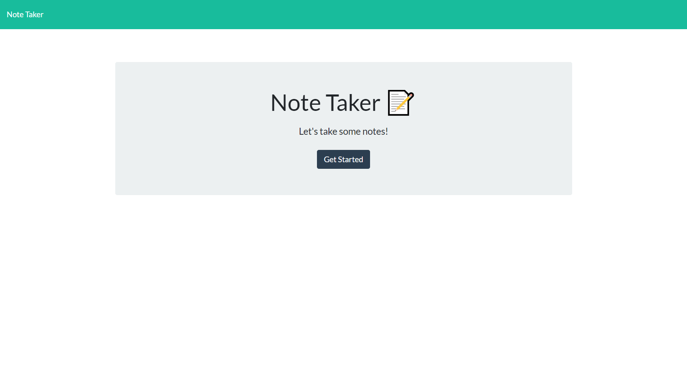
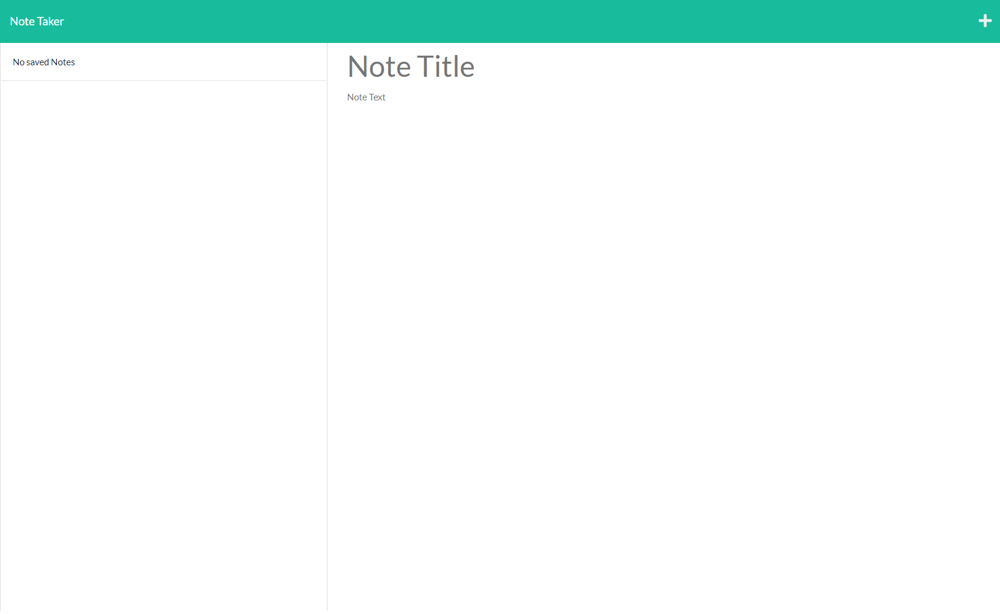
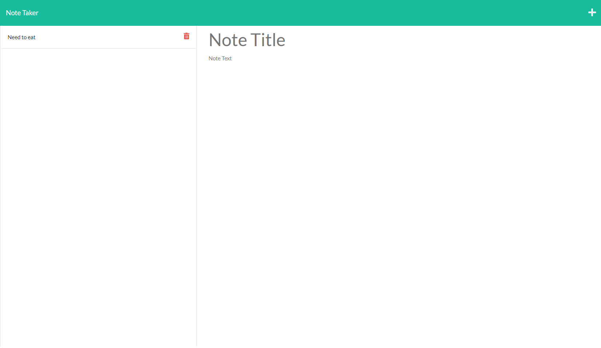
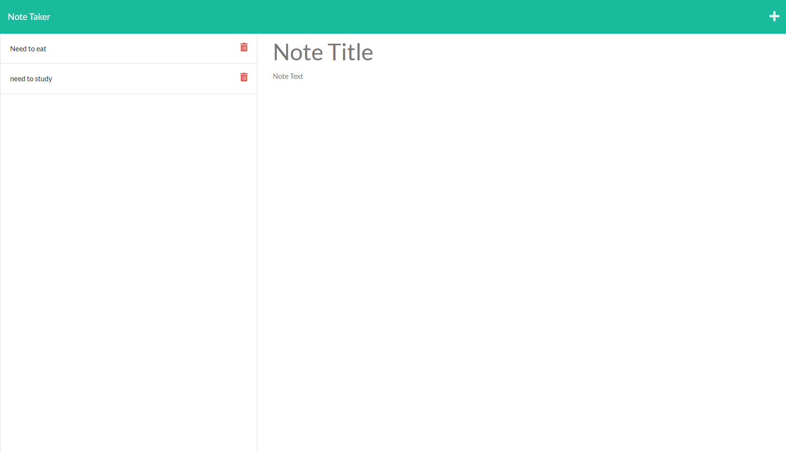
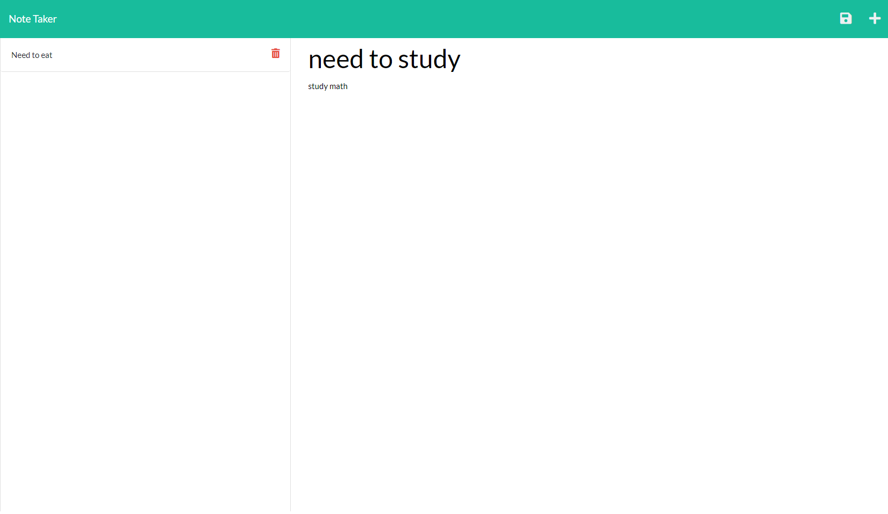
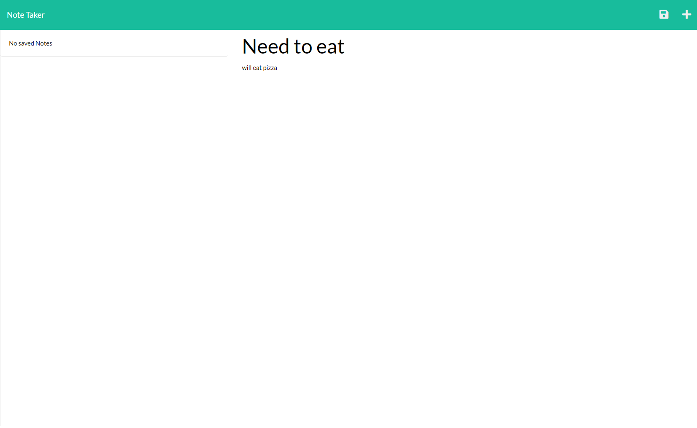

# Note Taker

## What is Note Taker
Note taker was created to save your notes and easily access them. You are able to create new notes, save them, and delete them. This project was created to show the use of Express.js.

## Installation
Download the file from GitHub and download node. It also requires UUID modules and Express.js

## Check it out

Click here to check it out: https://tranquil-fjord-08020.herokuapp.com/

## Contribution 
Made with ❤️ by James Killelea